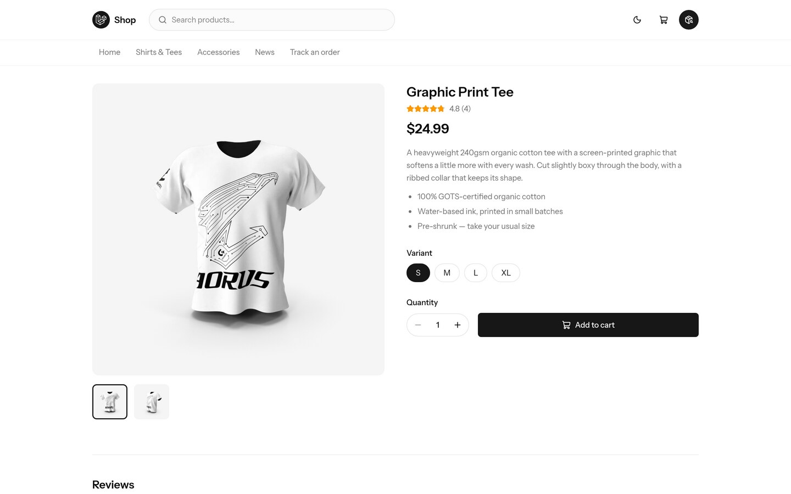
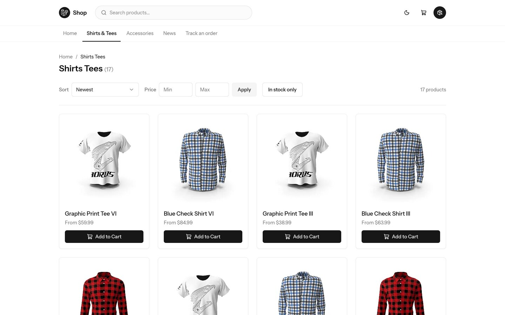
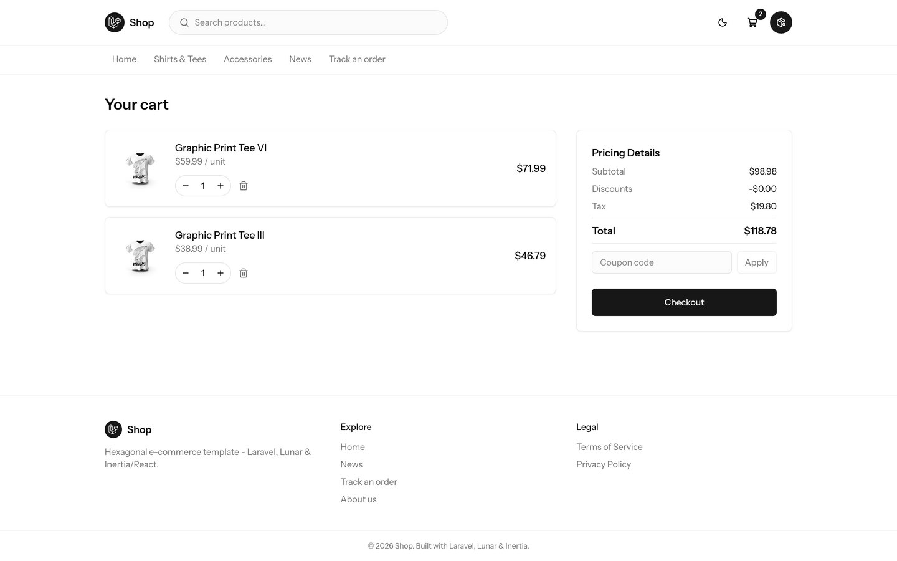
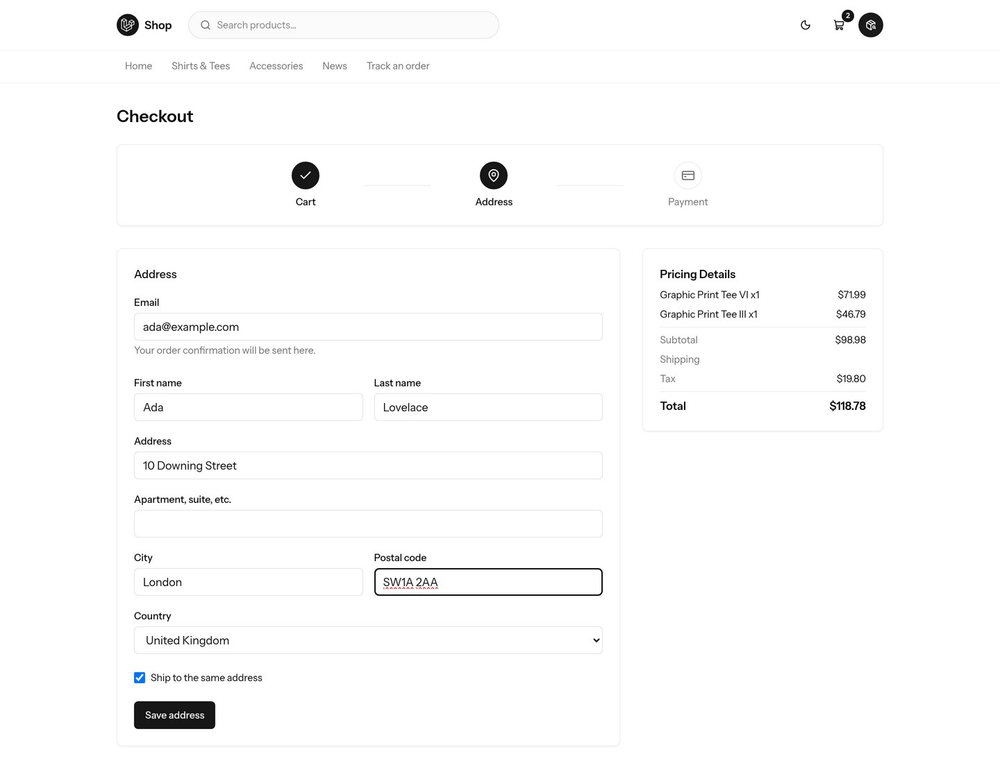
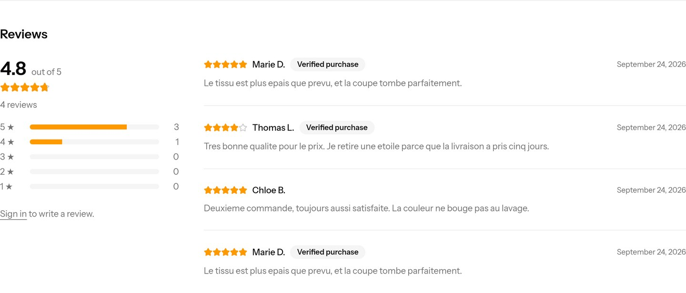
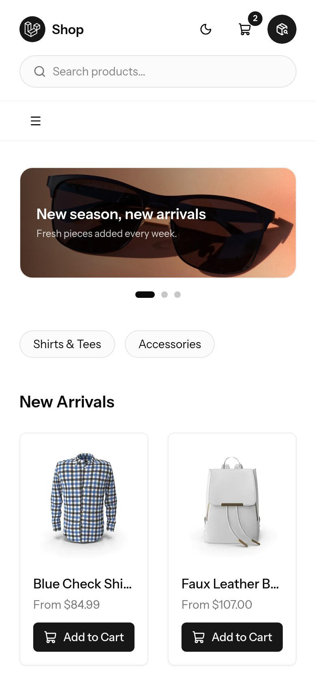
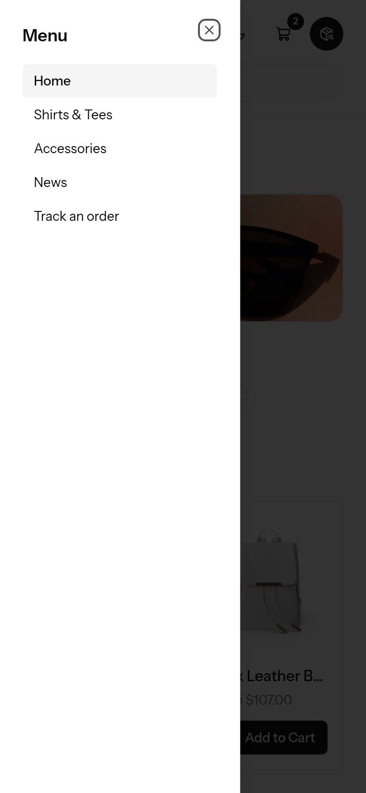
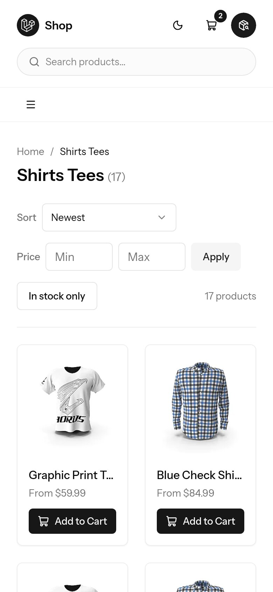
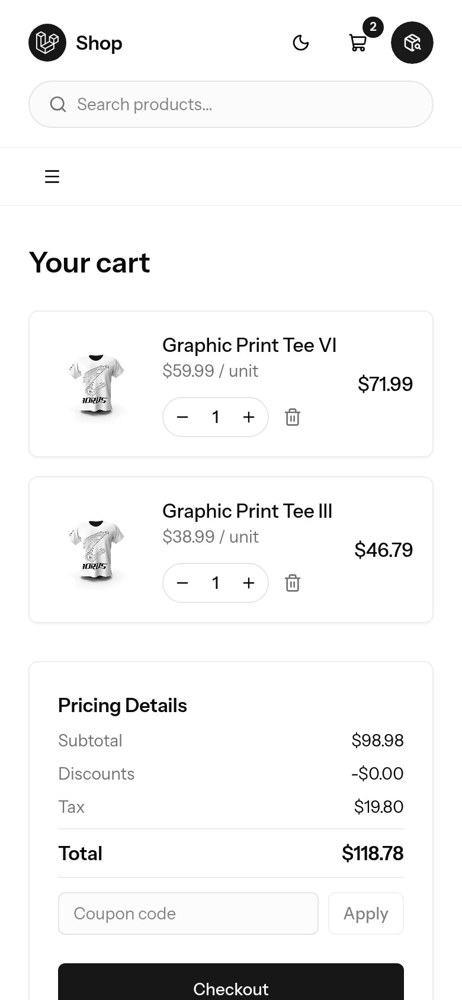

<div align="center">

# 🛍️ E-commerce Hexa Template

**A production-ready Laravel storefront that won't trap you in its own engine.**

Real payments, real shipping, real stock — behind an architecture
you can actually refactor.

[](https://laravel.com)
[](https://php.net)
[](https://lunarphp.io)
[](https://react.dev)
[](docs/development.md#tests)
[](#license)

</div>


---

Most e-commerce starters hand you a shop that works and a codebase you can't
move. This one keeps [LunarPHP](https://lunarphp.io) doing what it's good at —
catalog, pricing, taxes, carts, orders — but behind thin ports, so your
business logic never imports a single vendor class.

Swap the engine later, or don't. Either way the decision stays yours.

## ✨ What's inside

**Storefront**

- 🔎 Product catalog, collections and full-text search — paged,
  sortable and filterable
- 🛒 Cart with live stock enforcement and coupon codes
- 💳 Checkout: addresses, real shipping rates, tax, Stripe payment
- 📦 Customer accounts with order history — plus guest order lookup by
  reference + email
- ✉️ Order confirmation emails, legal page scaffolding
- ⭐ Product reviews with ratings — moderated in the admin, with the stars
  Google needs for a rich result
- 🎠 Homepage slider, custom pages and a news section — all editable in the
  admin, nothing hardcoded
- 🔁 Abandoned cart reminders with a signed recovery link and one-click
  unsubscribe
- 🎨 shadcn/ui interface with a light/dark toggle

**Behind the scenes**

- 🔐 Admin panel with enforced two-factor authentication
- 🚦 Rate limiting on every state-changing route
- 🩺 Error tracking, dependency auditing, GitHub Actions CI
- 🐳 FrankenPHP production image
- ✅ 137 feature tests against a real PostgreSQL — no mocked database

| | |
| :--: | :--: |
|  |  |
| **Product** — gallery, variants, live stock | **Listings** — sort, filter, paginate |
|  |  |
| **Cart** — coupons, tax, per-line quantities | **Checkout** — address, shipping, Stripe |
|  |  |
| **Reviews** — rated, moderated, verified | **Dark mode** — one toggle, everywhere |

Every page is built mobile-first — the grid reflows, the nav collapses into a
drawer, and the cart summary stacks under the items:

| | | | |
| :--: | :--: | :--: | :--: |
|  |  |  |  |

## 🚀 Quick start

No PHP or Node on your machine? The `bin/` wrappers run everything in Docker.

```sh
docker compose up -d                 # PostgreSQL + Mailpit
docker build -f docker/php/Dockerfile.dev -t lunar-starter .

./bin/composer install
cp .env.example .env && ./bin/artisan key:generate

./bin/artisan lunar:create-admin --firstname=Admin --lastname=User \
  --email=admin@example.com --password=password
./bin/artisan lunar:install --no-interaction
./bin/artisan db:seed                # demo catalog, shipping, taxes
./bin/artisan storage:link

./bin/npm install && ./bin/npm run build
./bin/artisan queue:work             # product images + emails
./bin/artisan serve                  # in another terminal
```

Storefront on **http://localhost:8000**, admin on **/lunar**, inbox on
**http://localhost:8025**.

> 💡 Payments need Stripe test keys — see
> [Configuring Stripe](docs/development.md#configuring-stripe-needed-to-test-payment).

## 🧱 How it's built

Three layers, one rule: **dependencies point inward.**

```
app/Domain/          Value objects + ports.      No Laravel. No Lunar.
app/Application/     Use cases.                  Speaks only to ports.
app/Infrastructure/  Lunar adapters.             The only place Lunar exists.
```

`DomainServiceProvider` wires each port to its adapter — one file, and it's
the whole composition root. Want to prove the boundary holds?

```sh
grep -rn "use Lunar\\\\" app/Domain app/Application   # returns nothing
```

The pattern is applied across Catalog, Cart, Checkout and Account, so there's
a worked example to copy from whichever context you extend next.

## 📚 Documentation

| Guide | What's in it |
| --- | --- |
| [Architecture](docs/architecture.md) | Why hexagonal, how far it's taken, and how to replace Lunar |
| [Features](docs/features.md) | Checkout, stock, search, coupons, accounts, content and cart reminders in depth |
| [Development](docs/development.md) | Install, configure, test, and every quality gate |
| [Deployment](docs/deployment.md) | FrankenPHP production image and topology |

## ⚠️ Not included

Deliberately out of scope, so you know what you're picking up:

- Live carrier rate lookups (table-rate shipping is built; real-time
  USPS/UPS/DHL quotes aren't)
- Saved address books — customers re-type their address each order
- Refunds and fulfillment tracking, which live in the admin panel
- Shipping-status emails (order confirmations and abandoned cart
  reminders are sent; "your order has shipped" isn't)
- `/terms` and `/privacy` are structural placeholders, **not legal advice**

Full detail in [Not included](docs/features.md#known-limitations).

## License

MIT. Build something with it.
