<div align="center">

# 🛍️ E-commerce Hexa Template

**A production-ready Laravel storefront that won't trap you in its own engine.**

Real payments, real shipping, real stock — behind an architecture
you can actually refactor.

[](https://laravel.com)
[](https://php.net)
[](https://lunarphp.io)
[](https://react.dev)
[](docs/development.md#tests)
[](#license)

</div>


---

Most e-commerce starters hand you a shop that works and a codebase you can't
move. This one keeps [LunarPHP](https://lunarphp.io) doing what it's good at —
catalog, pricing, taxes, carts, orders — but behind thin ports, so your
business logic never imports a single vendor class.

Swap the engine later, or don't. Either way the decision stays yours.

## ✨ What's inside

**Storefront**

- 🔎 Product catalog, collections and full-text search — paged,
  sortable and filterable
- 🛒 Cart with live stock enforcement and coupon codes
- 💳 Checkout: addresses, real shipping rates, tax, Stripe payment
- 📦 Customer accounts with order history — plus guest order lookup by
  reference + email
- ✉️ Order confirmation and status emails — "it has shipped", with a
  progress bar on the order page
- 🏷️ Quantity pricing — buy 3 or 5, pay less each, with the packs shown on
  the product page
- 📦 Product bundles — sold as one line, priced on their own, limited by
  their scarcest part
- ⭐ Product reviews with ratings — moderated in the admin, with the stars
  Google needs for a rich result
- 🎠 Homepage slider, custom pages and a news section — all editable in the
  admin, nothing hardcoded
- 🔁 Abandoned cart reminders with a signed recovery link and one-click
  unsubscribe
- 🏭 **Optional ERP sync** — every paid order pushed to Odoo or Dolibarr,
  customer included, off by default
- 🎨 shadcn/ui interface with a light/dark toggle

**Behind the scenes**

- 🔐 Admin panel with enforced two-factor authentication
- 🚦 Rate limiting on every state-changing route
- 🩺 Error tracking, dependency auditing, GitHub Actions CI
- 🐳 FrankenPHP production image
- ✅ 194 tests against a real PostgreSQL — no mocked database

| | |
| :--: | :--: |
| 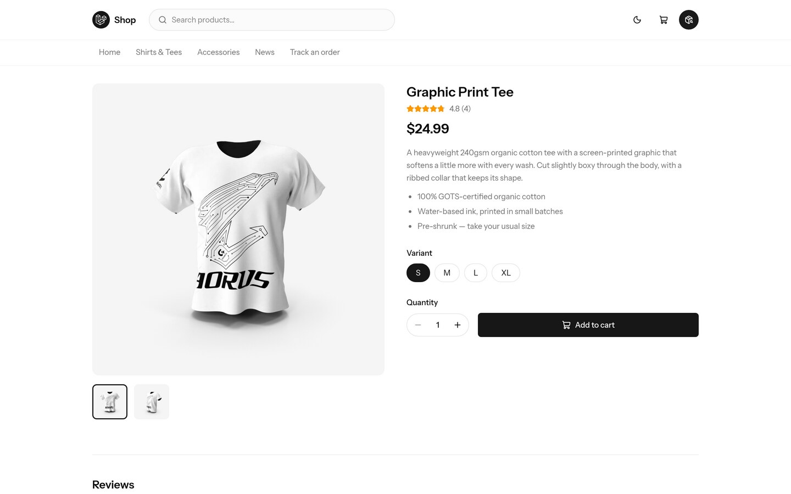 | 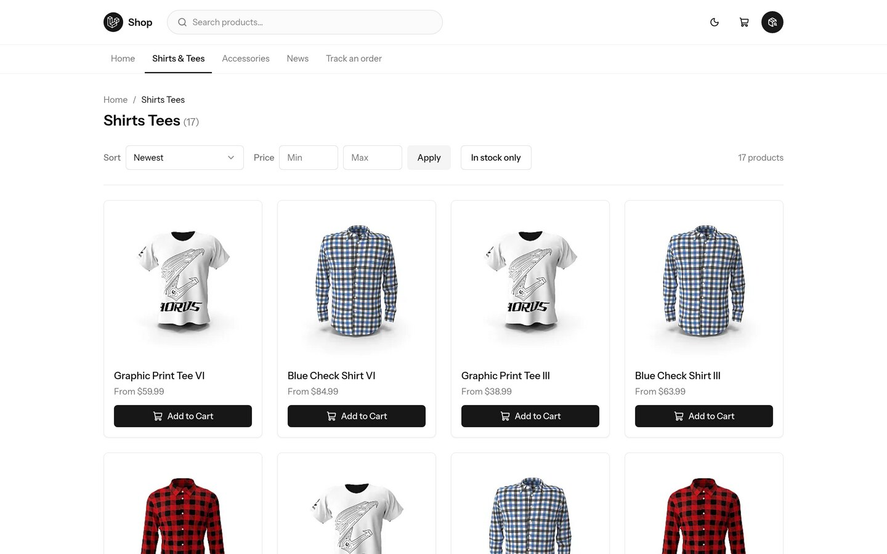 |
| **Product** — gallery, variants, live stock | **Listings** — sort, filter, paginate |
| 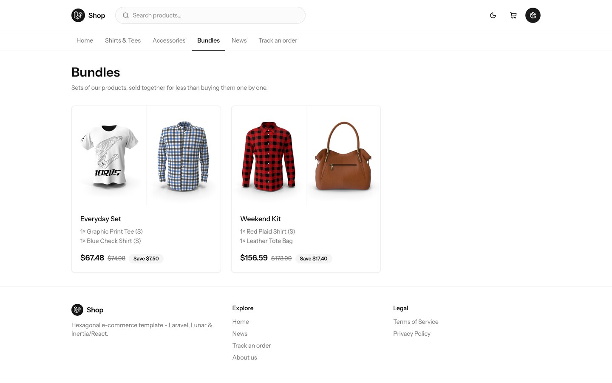 | 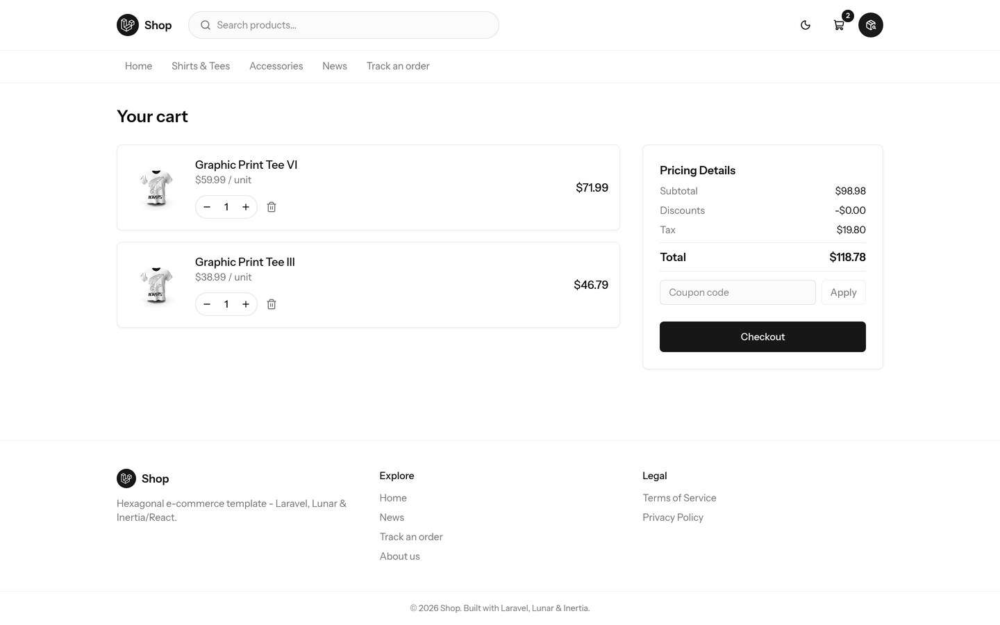 |
| **Bundles** — one line, one price, real stock | **Cart** — coupons, tax, per-line quantities |
| 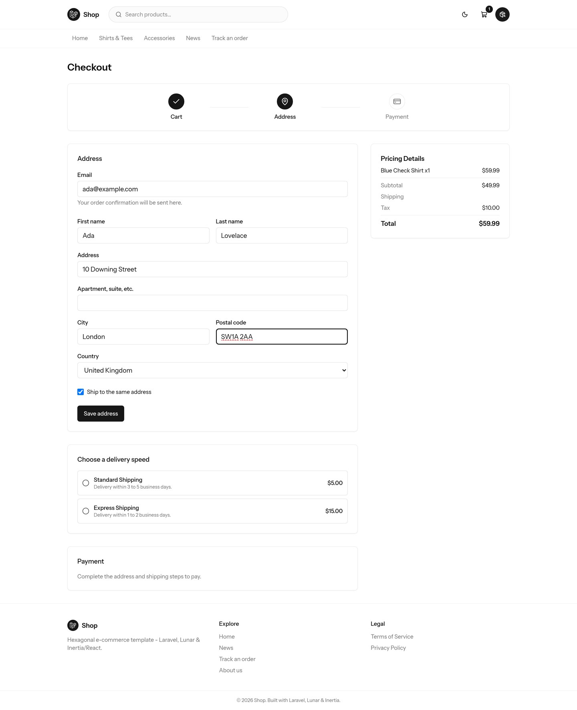 | 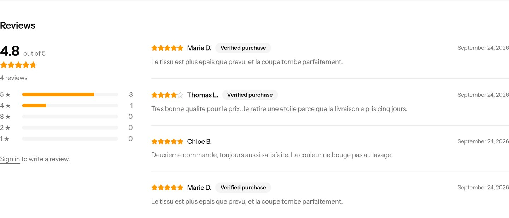 |
| **Checkout** — address, shipping, Stripe | **Reviews** — rated, moderated, verified |
| 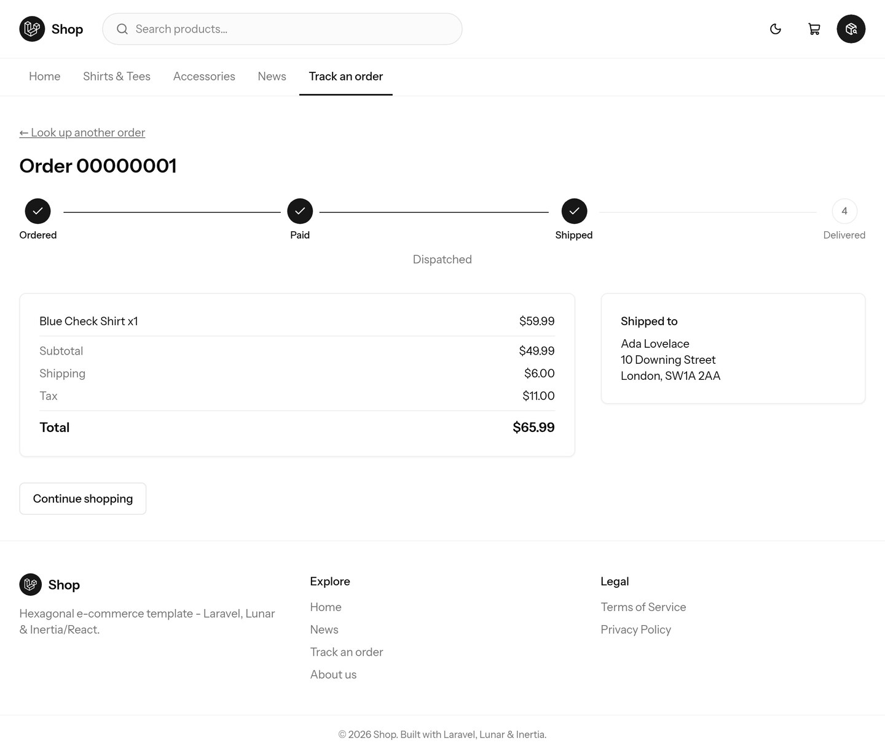 |  |
| **Order tracking** — emailed as it moves | **Dark mode** — one toggle, everywhere |

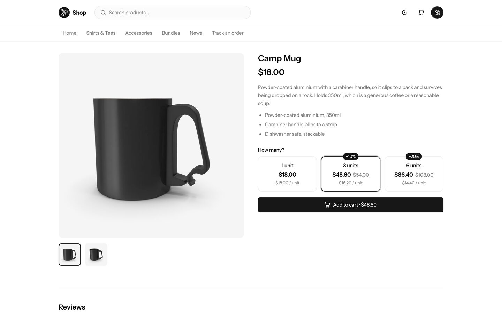

**Quantity packs** — buy 3 or 6 and each one costs less. Every figure comes
from the server, the saving is rounded down, and the button carries the total
the cart will actually charge.

Every page is built mobile-first — the grid reflows, the nav collapses into a
drawer, and the cart summary stacks under the items:

| | | | |
| :--: | :--: | :--: | :--: |
| 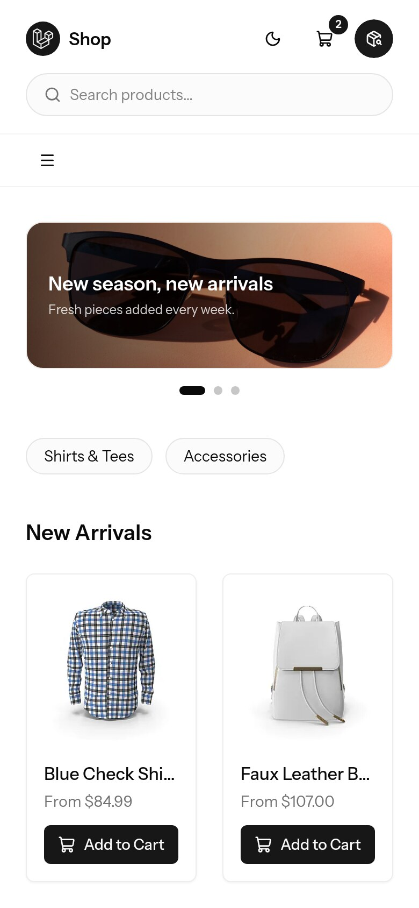 | 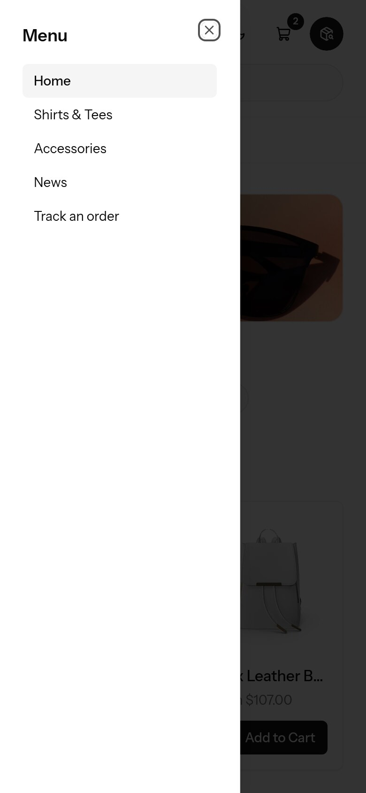 | 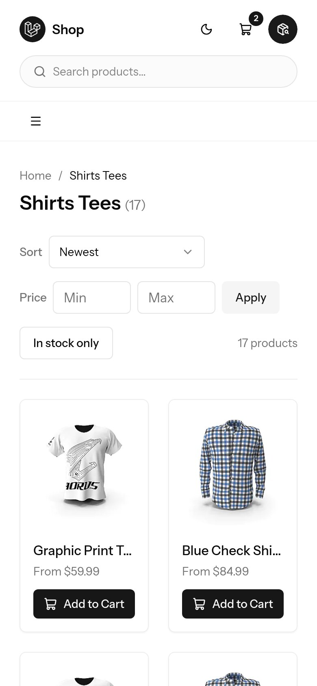 | 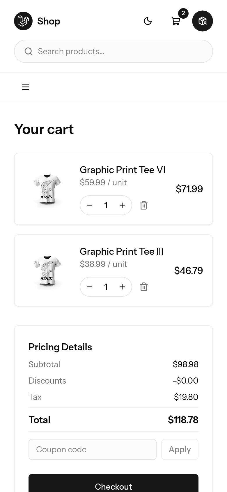 |

## 🚀 Quick start

No PHP or Node on your machine? The `bin/` wrappers run everything in Docker.

```sh
docker compose up -d                 # PostgreSQL + Mailpit
docker build -f docker/php/Dockerfile.dev -t lunar-starter .

./bin/composer install
cp .env.example .env && ./bin/artisan key:generate

./bin/artisan lunar:create-admin --firstname=Admin --lastname=User \
  --email=admin@example.com --password=password
./bin/artisan lunar:install --no-interaction
./bin/artisan db:seed                # demo catalog, shipping, taxes
./bin/artisan storage:link

./bin/npm install && ./bin/npm run build
./bin/artisan queue:work             # product images + emails
./bin/artisan serve                  # in another terminal
```

Storefront on **http://localhost:8000**, admin on **/lunar**, inbox on
**http://localhost:8025**.

> 💡 Payments need Stripe test keys — see
> [Configuring Stripe](docs/development.md#configuring-stripe-needed-to-test-payment).

## 🧱 How it's built

Three layers, one rule: **dependencies point inward.**

```
app/Domain/          Value objects + ports.      No Laravel. No Lunar.
app/Application/     Use cases.                  Speaks only to ports.
app/Infrastructure/  Lunar + ERP adapters.       The only place they exist.
```

`DomainServiceProvider` wires each port to its adapter — one file, and it's
the whole composition root. Want to prove the boundary holds?

```sh
grep -rn "use Lunar\\\\" app/Domain app/Application   # returns nothing
```

The pattern is applied across Catalog, Cart, Checkout and Account, so there's
a worked example to copy from whichever context you extend next.

## 🏭 Pushing orders to an ERP

Optional, and off unless asked for. `ERP_DRIVER=none` — the default — binds a
gateway that does nothing, so a shop without an ERP configures nothing and
switches nothing off. Two adapters ship:

| `ERP_DRIVER` | What it talks to |
| --- | --- |
| `none` | nothing, and that is the default |
| `odoo` | Odoo over JSON-RPC (`res.partner`, `sale.order`) — verified on 18 |
| `dolibarr` | Dolibarr over REST (`thirdparties`, `orders`) — verified on 24 |

Odoo and Dolibarr because they are the two ERPs shops this size actually run,
and because both can be stood up locally — the adapters were built against a
real Odoo 18 and a real Dolibarr 24, not against their documentation:

```sh
docker compose -f docker-compose.erp.yml up -d odoo odoo-db        # :8069
docker compose -f docker-compose.erp.yml up -d dolibarr dolibarr-db # :8081
```

**When a customer pays**, the order and its customer are pushed by a queued
job. Queued because the money has already moved: an ERP mid-upgrade must not
turn a successful payment into a 500 on the thank-you page. A failed push
retries with a long backoff and then lands in `failed_jobs` with the order
intact.

**Pushing twice is safe.** Each adapter asks the ERP whether it already holds
the shop's order reference — `client_order_ref` in Odoo, `ref_client` in
Dolibarr — rather than keeping a local record. An ERP restored from a backup,
or an order someone keyed in by hand, then still gives the right answer.

**The lines add up to what was charged.** Shipping, discounts and tax are each
carried as their own line, because the domain keeps only *products* in
`$order->lines`. Skipping that is not hypothetical: the first version of both
adapters recorded a 57.38 order as 52.48 in both ERPs, and `ErpOrderLines` plus
its tests exist because of it.

**Tax is a line, not a tax code.** Every line is pushed tax-free with the tax
the shop charged alongside it, so the ERP total matches the payment processor
to the cent. The trade-off, stated plainly: the ERP will not see that amount as
tax, so it will not appear in its VAT reports. A shop that needs that should map
its rates onto the ERP's tax codes in the adapter and accept that the two
systems can then disagree.

Adding a third ERP is one class: implement `App\Domain\Erp\Port\ErpGateway`,
add a `match` arm in `DomainServiceProvider`. Nothing in `app/Domain` or
`app/Application` moves.

## 📈 Analytics

Optional, and off unless asked for. With no id configured, not one byte of
Google is served — which is also the state the test suite and local
development run in.

| Variable | What it loads |
| --- | --- |
| `GOOGLE_TAG_MANAGER_ID` | Tag Manager (`GTM-…`), which then loads whatever tags the container holds |
| `GOOGLE_ANALYTICS_ID` | GA4 directly through gtag.js (`G-…`) |
| `ANALYTICS_REQUIRE_CONSENT` | Consent Mode defaults, on by default |

**Use one or the other.** A GA4 tag inside the container *and* the measurement
id here counts every page view twice, and nothing in the resulting data says
which half to discard.

**Ids are validated, not just printed.** They land inside a `<script>` block,
where Blade's escaping does not reach: an id that doesn't match `GTM-…` or
`G-…` exactly is dropped rather than rendered. `GTM-X');evil('` is a perfectly
valid environment variable.

**The ecommerce funnel is reported, not just page views.** `view_item`,
`add_to_cart`, `remove_from_cart`, `view_cart`, `begin_checkout`,
`add_shipping_info`, `add_payment_info` and `purchase`, in GA4's own shape —
pushed to the dataLayer wrapped in `ecommerce` for Tag Manager, and flat to
`gtag`, because the two read different shapes and sending one to both reports
nothing to the other.

Four things in there are the difference between a report you can trust and one
you cannot:

- **`purchase` fires once per order, and the server decides.** The
  confirmation page keeps the order in the session, so it survives a refresh,
  a back button and a shared link. The flag is `pull`ed, so only the first
  render carries it. The trade-off is deliberate: if that render never reaches
  the browser the sale goes unreported, because missing one order is a gap
  while inventing one inflates the revenue you reconcile against Stripe.
- **Amounts are decimals, not minor units.** The conversion uses the
  `decimal_places` the amount carries rather than dividing by 100 — two for
  the euro, zero for the yen.
- **Price breaks are honoured.** Three mugs at a tier do not cost three times
  one mug, and reporting the list price would show value evaporating between
  the cart and the purchase for a reason that is not abandonment.
- **A quantity change is a delta.** GA4 has no "quantity changed": going from
  3 to 1 is a removal of two, not of the whole line.

Items are identified by `item_name`, not an id: a cart line deliberately knows
nothing about what is on it — it may hold one variant or a whole bundle — so
there is no product reference to send from the cart or the order, and using
the name everywhere at least keeps one funnel joined. Two products sharing a
name are one row in the reports, and renaming one starts a new row. Fixing
that means carrying a stable reference on `CartLine` and `OrderLine`, which is
a domain change, not an analytics one.

**A page view is reported per Inertia navigation, not per page load.** Both
Google tags count a view when the document loads, which on this storefront
happens once. Without `resources/js/lib/analytics.ts`, a visitor who browses a
collection, opens three products and checks out is recorded as having seen one
page. The first view still comes from the tag itself, so a visitor whose
JavaScript fails is not lost, and the listener skips the url it was loaded on
so that view is not counted twice.

**Consent is denied before any tag loads**, for every storage type Google
defines, because in the EU that is the condition under which these scripts may
run at all — not a preference. `ANALYTICS_REQUIRE_CONSENT=false` loads them
granted from the first byte; it is the configuration that produces complete
reports and the one a French shop gets fined for. The choice is yours, and
deliberately not the default.

**The banner is only mounted when there is something to ask.** A tag
configured *and* consent required — nothing else. A banner on a site that sets
no analytics cookie either way is theatre, and the kind that teaches people to
click "accept" without reading. Refusing is one click, exactly like accepting,
which is not a design preference: a banner where "accept" is a button and
"refuse" is three menus deep is the thing regulators actually fine. The answer
is kept in `localStorage` rather than a cookie — the one record that must not
itself need consent — and re-applied by the inline script *before* the tags
load, so a visitor who accepted last week does not spend the first second of
every page refused. A "Cookies" link in the storefront footer reopens it,
because withdrawing has to be as easy as giving.

What is **not** covered, and is yours to write: the cookie section of
`/privacy` naming what each tag stores and for how long. The banner links to
that page; it cannot write it for you.

## 📚 Documentation

| Guide | What's in it |
| --- | --- |
| [Architecture](docs/architecture.md) | Why hexagonal, how far it's taken, and how to replace Lunar |
| [Features](docs/features.md) | Checkout, stock, search, coupons, accounts, content and cart reminders in depth |
| [Development](docs/development.md) | Install, configure, test, and every quality gate |
| [Deployment](docs/deployment.md) | FrankenPHP production image and topology |

## ⚠️ Not included

Deliberately out of scope, so you know what you're picking up:

- Live carrier rate lookups (table-rate shipping is built; real-time
  USPS/UPS/DHL quotes aren't)
- Saved address books — customers re-type their address each order
- Refunds and fulfillment tracking, which live in the admin panel
- Shipping-status emails (order confirmations and abandoned cart
  reminders are sent; "your order has shipped" isn't)
- The cookie section of `/privacy` — the consent banner ships and links there,
  but naming what each tag stores, and for how long, is yours to write
- `/terms` and `/privacy` are structural placeholders, **not legal advice**

Full detail in [Not included](docs/features.md#known-limitations).

## License

MIT. Build something with it.
